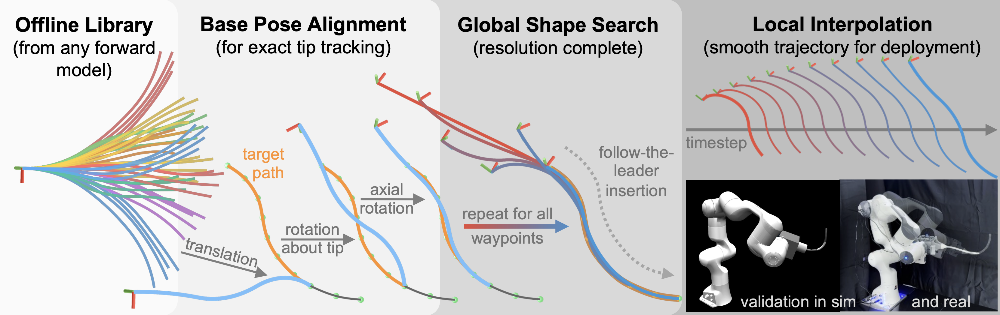

# Sampling-Based Follow-the-Leader Motion Planner



Open source implementation of the paper *Sampling-Based Follow-the-Leader Motion Planning for Manipulator-Mounted Continuum Robots* (Insert link and in repo description -->).

> **Try it in your browser:** [Here](https://nicholas-baldassini.github.io/Sampling-Based-Follow-the-Leader-Motion-Planning-for-Manipulator-Mounted-Continuum-Robots/)

### Abstract

```
Follow-the-leader (FTL) motion exploits the unique morphology of continuum robots (CRs) 
to navigate confined spaces by having the body retrace the path of the tip. While 
extensively studied, existing FTL methods typically assume a fixed base or a single 
degree-of-freedom insertion mechanism, limiting their applicability to practical systems 
in which CRs are mounted on robotic manipulators with full six-degree-of-freedom pose 
control. This paper presents a sampling-based motion planner for FTL motion of 
manipulator-mounted CRs that jointly considers robot configuration and base pose. The key 
idea is to decouple global shape search from base pose determination by computing the 
base pose through a closed-form geometric construction, thereby avoiding iterative 
optimization during online planning. The approach supports general forward models and 
enables efficient planning by shifting the majority of computation offline. We establish 
theoretical guarantees including resolution completeness of the shape search and exact 
tip tracking throughout waypoint traversal and interpolation. Experiments on 120 
simulated paths over 3 test classes demonstrate 0% tip error and 1.9% mean shape 
deviation (w.r.t. robot length) at 100% success rate. We validate the practicality of our 
approach on a 6-DOF tendon-driven CR mounted on a serial manipulator.
```

## Contents
- [Installation](#installation)
- [Quick run](#quick-run)
- [Defining your robot](#defining-your-robot)
- [Building a shape library](#building-a-shape-library)
- [Defining a path](#defining-a-path)
- [Solving for a motion plan](#solving-for-a-motion-plan)
- [Repository layout](#repository-layout)
- [Citation](#citation)

## Installation

```bash
git clone <this-repo>
cd SamplingBasedFollowTheLeaderMotionPlanner
python -m venv .venv && source .venv/bin/activate
pip install -r requirements.txt
```

Tested with Python 3.11

## Quick run

End-to-end demo on a Bezier curve with the threshold-clustered planner and a 15,000-shape library:

```bash
python run_example.py
```

A few useful variations:

```bash
# Linear-search baseline on an S-shape, 20k library, no animation
python run_example.py --planner "No Cluster/Linear Sampling" --curve s \
    --num-samples 20000 --no-animate

# Use an externally produced shape library (skips library generation)
python run_example.py --shape-lib-path /path/to/library.json

# Save the dense motion plan (Clarke coords + base SE(3) + shape per step) to JSON
python run_example.py --save-history my_plan.json
```

`python run_example.py --help` lists every flag.

What the script does:
1. Builds a 3-segment constant-curvature robot.
2. Generates a target curve (`--curve {bezier,s,c,robot}`).
3. Builds the chosen planner with a fresh shape library (or loads one from disk).
4. Runs `follow_path` to produce a sparse motion plan.
5. Runs `interpolate_mp` to densify it.
6. Reports tip and shape deviation as percentages of robot length.
7. Animates the sparse and dense plans (unless `--no-animate`).

## Defining your robot

Robot models live in [`src/RobotModels/`](src/RobotModels/). All models inherit from `ContinuumRobotModel` and must implement `forward_kinematics`. We include a `ConstantCurvature` model in this repo:

```python
from src.RobotModels.ConstantCurvatureModel import ConstantCurvature

robot = ConstantCurvature(
    num_segments=3,                # number of CR segments
    segment_lengths=[1, 1, 1],     # length of each segment
    tendon_offset=[0.2, 0.2, 0.2], # tendon offset from the backbone, per segment
    points_resolution=0.05,        # sampling resolution of backbone points (units = robot length)
)
```

`forward_kinematics(clarke_coords)` returns `(endpoints, shape_points, tip_SE3)` for any Clarke configuration of length `2 * num_segments`.

To use a different forward model (PRB, Cosserat-rod, learned), subclass `ContinuumRobotModel` and implement `forward_kinematics` so it returns `(endpoints, shape_points, tip_SE3)` in the same convention as `ConstantCurvature`. The planner only requires the forward model when generating a shape library — at planning time it works against the precomputed library and never calls the FM, which is why arbitrary models are supported.

## Building a shape library

The planner operates on a precomputed library of `(Clarke coordinates, backbone shape, arc-length)` tuples. There are three ways to obtain one:

### 1. Generate it on the fly (default)

Every planner constructor generates a library from `robot.forward_kinematics` if no library is supplied:

```python
from src.MasterClass import GeneralPathFollower

general_follower = GeneralPathFollower(robot)
follower = general_follower.get_sampling_threshold_cluster(
    num_samples=5_000,             # library size
    base_stability_weight=0.3,
    base_stability_weight_rot=0.1,
)
```

Library generation is parallelized across CPU cores by default (`parallel_lib_gen=True`).

### 2. Generate once, save to disk, reload later

Useful when generation is expensive (large library, slow forward model):

```python
follower = general_follower.get_sampling_threshold_cluster(num_samples=20_000)
follower.save_curr_shape_library("my_library.json")
```

then on subsequent runs:

```python
follower = general_follower.get_sampling_threshold_cluster(
    num_samples=1,                                 # ignored when loading
    custom_shape_lib_path="my_library.json",
)
```

### 3. Provide your own external library

If you generate shapes from a physics simulator, learned model, or hardware system identification, write them as a JSON document with this schema:

```json
{
    "meta": {
        "num_tendons": 3,
        "num_segments": 3
    },
    "shapes": [
        {
            "clark_coords":           [c11, c12, c21, c22, c31, c32],
            "shape_points":           [[x, y, z], ...],
            "endpoints":              [[x, y, z], ...],
            "tip_position":           [x, y, z],
            "arc_length":             3.0,
            "arc_length_cumulative":  [0.0, ..., 3.0]
        }
    ]
}
```

`shape_points` is the discretized backbone (D+1 points), `endpoints` is the per-segment end positions, and `arc_length_cumulative` is the cumulative arc length along the backbone (length D+1). Pass the file via `custom_shape_lib_path=...` (in code) or `--shape-lib-path` / `--shape-lib-template` (on the CLI). The forward model used to *generate* the library does not need to be available at planning time but does need to be during post-processing (interpolation).

## Defining a path

A path is a `(N, 3)` numpy array of waypoints. This repo ships a small library of path shapes in [`src/PathGenerators/PathGenerator.py`](src/PathGenerators/PathGenerator.py); pick whichever fits your task or pass any `(N, 3)` array.

```python
import numpy as np
from src.PathGenerators.PathGenerator import TaskGenerator

generator = TaskGenerator(robot)

# Quadratic Bezier through a control point
waypoints = generator.generate_curved_path(
    np.array([0, 0, 0]),
    np.array([2, 0, 1.3]),
    np.array([0, 0, 1.6]),
    num_waypoints=10,
)

# Cubic-Bezier S-shape between two endpoints
waypoints = generator.generate_s_shape_path(
    np.array([0, 0, 0]), np.array([-2.3, 0, 0.8]), num_waypoints=10
)

# Semi-circular C-shape between two endpoints, optionally rotated about the chord
waypoints = generator.generate_c_shape_path(
    np.array([0, 0, 0]), np.array([-2.3, 0, 0.8]), radial_angle=0, num_waypoints=10
)

# Backbone of a robot configuration (always realizable at full insertion)
waypoints = generator.sample_from_robot_shape(
    np.array([0, 0.1, 0, 0.2, -0.3, -0.1]), num_waypoints=10
)
```

## Solving for a motion plan

Single end-to-end call:

```python
import time
from src.MasterClass import GeneralPathFollower

general_follower = GeneralPathFollower(robot)
follower = general_follower.get_sampling_threshold_cluster(
    num_samples=20_000,
    base_stability_weight=0.3,
    base_stability_weight_rot=0.1,
)

# 1. Sparse plan: one (Clarke coords, base SE(3)) per waypoint
sparse_plan = follower.follow_path(waypoints)

# 2. Dense plan: linearly interpolate the tip, exploit radial symmetry to keep base smooth
dense_plan, dense_waypoints = general_follower.interpolate_mp(
    sparse_plan, steps_per_waypoint=40, enable_optimization=True
)

# 3. Metrics, normalized to robot length
tip_dev   = general_follower.compute_tip_deviation(dense_plan, dense_waypoints)
shape_dev = general_follower.compute_shape_deviation_closest(dense_plan, dense_waypoints)
```

### Available planners

| Name (use as `planner_name`)   | Class                | Notes |
|--------------------------------|----------------------|-------|
| `"No Cluster/Linear Sampling"` | `SamplingNoCluster`  | Brute-force linear search over the library. Resolution-complete; baseline in the paper. |
| `"Threshold Cluster"`          | `ThresholdCluster`   | Threshold-γ clustering, two-pass search (paper §III-A-2). Default; recommended for general use. |
| `"Direct Optimization"`        | `DirectOptimization` | L-BFGS-B baseline (no library). Used as the comparison in Table I. |

### Common parameters

| Parameter                   | Meaning |
|-----------------------------|---------|
| `num_samples`               | Library size. Larger = more accurate, slower to generate. Paper used 20,000. |
| `base_stability_weight`     | Penalty weight for base translation between consecutive waypoints. |
| `base_stability_weight_rot` | Penalty weight for base rotation between consecutive waypoints. |
| `similarity_threshold`      | γ in paper §III-A-2; threshold radius for `ThresholdCluster`. Auto-selected if `None`. |
| `custom_shape_lib_path`     | Skip library generation and load this JSON instead. |

## Repository layout

```
src/
  RobotModels/                 ContinuumRobotModel + concrete forward models
  PathGenerators/              Curve generators and config-driven curve library
  MotionPlanners/
    GeneralMotionPlanner.py    Shared library generation + shape evaluation
    SamplingBased/             SamplingNoCluster (linear) + ThresholdCluster (paper §III-A-2)
    OptimizationBased/         DirectOptimization (L-BFGS-B baseline, paper §V-B)
    ShapeMatching.py           3-point shape-to-path alignment (closed-form base pose)
  Visualizations/              PathVisualizer (matplotlib animation)
  utils/                       Curve, parallel, and SE(3) helpers
  MasterClass.py               GeneralPathFollower: planner orchestration + interpolation + metrics

run_example.py                 Single-curve demo
```

## Citation

```bibtex
@inproceedings{
anonymous2026samplingbased,
    title={Sampling-Based Follow-the-Leader Motion Planning for Manipulator-Mounted Continuum Robots},
    author={Anonymous},
    booktitle={Robotics: Science and Systems 2026},
    year={2026},
    url={https://openreview.net/forum?id=m1EMlnV1mk}
}
```
